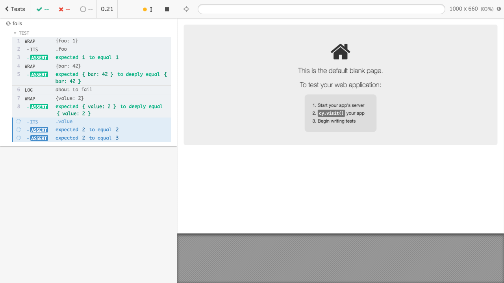
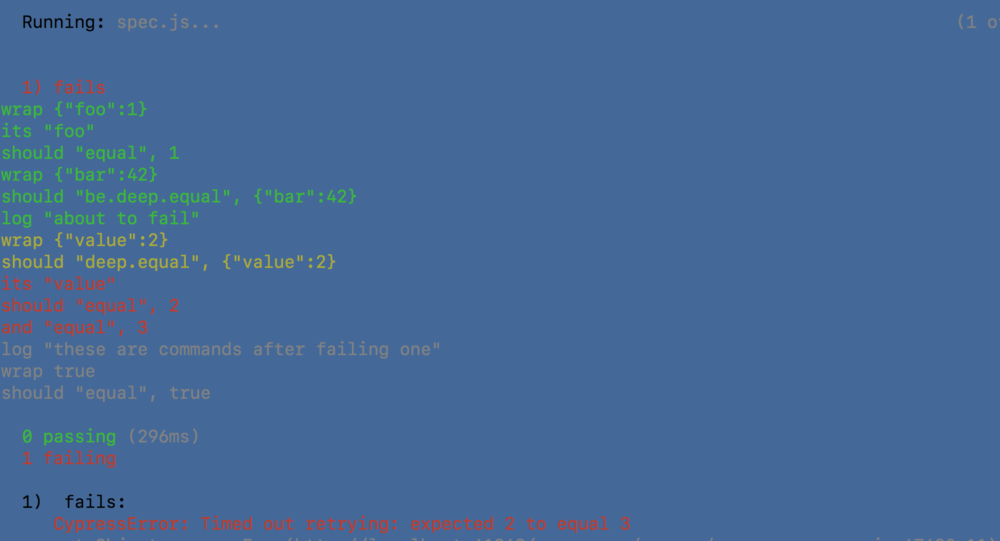
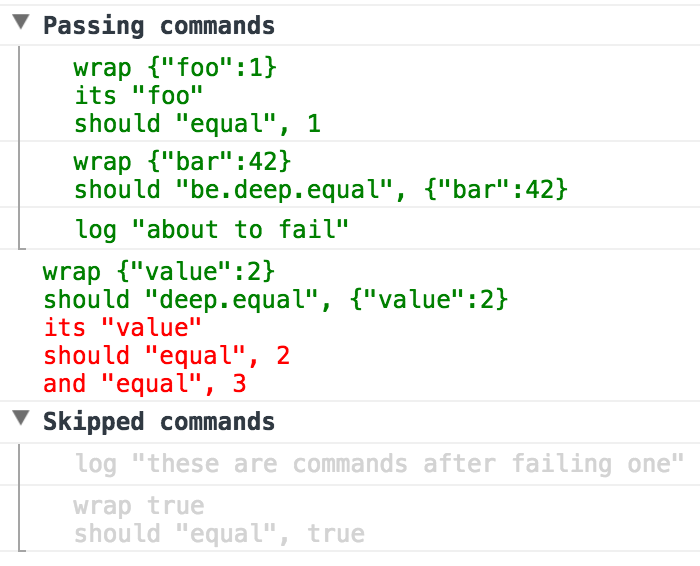

> Prints the failed Cypress command chain in the terminal

If a Cypress test fails using `cypress run` you only get the assertion message in the terminal. This plugin prints the failing command, the passing commands before it and the skipped commands after the failure - so you can see _where_ the test has failed.

For example, the typical terminal Cypress error message shown below is less than helpful

```
1)  fails:
  CypressError: Timed out retrying: expected 2 to equal 3
  at Object.cypressErr (http://localhost:61363/__cypress/runner/cypress_runner.js:67630:11)
  at Object.throwErr (http://localhost:61363/__cypress/runner/cypress_runner.js:67595:18)
  at Object.throwErrByPath (http://localhost:61363/__cypress/runner/cypress_runner.js:67622:17)
  at retry (http://localhost:61363/__cypress/runner/cypress_runner.js:61304:16)
```

You would need to open the screenshot taken on failure to see the problem



Nice, but requires being able to store and open image artifacts, which is complicated on some CIs like Travis.

With this plugin, the terminal shows the commands on failure. Passing command chains are shown in green, the passing commands in the failed chain are shown in yellow, and failed command is shown in red, and the commands after the failure are shown in grey, because they were not executed.



This plugin even prints the commands in the DevTools using groups


